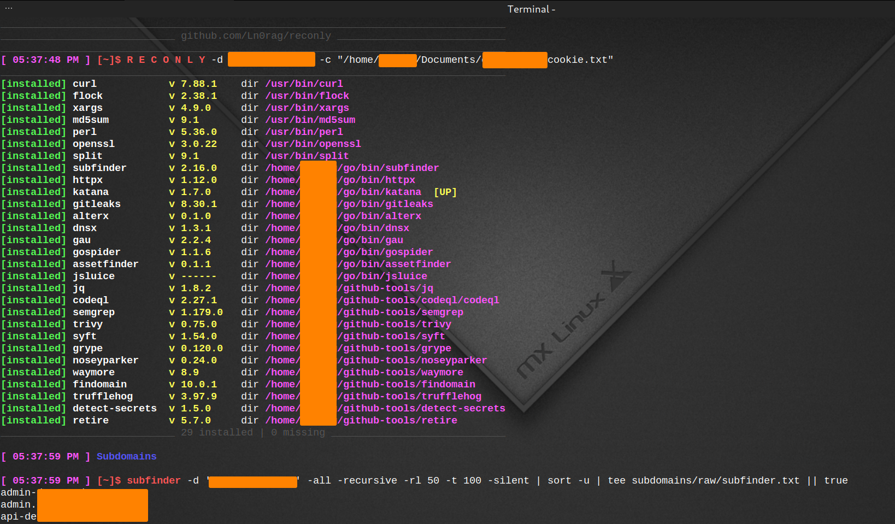

# reconly



**Note:** This script is currently under development and is uploaded to reserve the name "reconly". While the script is functional, it is being improved and expanded. Your feedback and contributions are welcome!

reconly is a single-file Bash recon and attack-surface mapping tool for a single target domain. It chains subdomain enumeration, live-host probing, URL/archive collection, JavaScript crawling and deobfuscation, secret/regex hunting, live token verification against real provider APIs, and quick vulnerability probing, then renders everything into one self-contained HTML report.

Before anything else: reconly installs and relies heavily on Go-based tools (subfinder, httpx, katana, dnsx, alterx, gau, gospider, assetfinder, jsluice, gitleaks). Make sure Go is installed on your machine first. If it is not, set it up with this guide: https://github.com/Ln0rag/go-setup

## Important: authorized use only

reconly actively sends captured credentials to live third-party APIs (GitHub, Stripe, Slack, Telegram, Google, GitLab, NPM, SendGrid, OpenAI, Anthropic, Groq, HuggingFace, OpenRouter, Twilio, Mailgun, DigitalOcean, Datadog, Dropbox, and more) to check if they are active, and probes Firebase databases and S3 buckets for public exposure. Only run this against domains and applications you own or are explicitly authorized to test. The script itself prints an OPSEC warning before the token-verification stage.

## What it does, stage by stage

reconly runs the following stages in order for every scan. Each stage writes its output into the session directory and is logged with a timestamp and status in the final report.

1. **Subdomains** — runs `subfinder`, `assetfinder`, and `findomain` in parallel, merges and dedupes the results, filters out domains flagged with registry holds (pending delete, client hold, etc.), checks for wildcard DNS, and if no wildcard is found runs `alterx` permutations resolved through `dnsx` to discover additional live subdomains. Diffs against the previous scan of the same domain to flag newly appeared subdomains.
2. **Archive** — pulls historical URLs for the domain from the Wayback Machine / archive sources via `waymore` and `gau`, merges and dedupes them into a master archive URL list.
3. **Hosts** — probes every discovered subdomain across a fixed set of common web ports (22, 80, 443, 3000, 4000, 5000, 6000, 7000, 8000, 8080, 8443, 9000, 8888, 9999) with `httpx`, capturing status code, technology stack, title, redirect location, IP, CNAME, TLS info, websocket support, and favicon hash.
4. **Auth** — lightweight authenticated-surface pass using the supplied cookie/headers, used to seed later authenticated crawling.
5. **Crawl** — crawls all live hosts with `katana` (JS-aware, headless-optional, known-files, form extraction) both unauthenticated and (if a cookie/header is supplied) authenticated, then diffs the two to find URLs reachable only when logged in. Falls back to or supplements with `gospider` when katana's yield is low. Also replays a rotating window of in-scope archive URLs through katana each run to "revive" old endpoints that no longer appear in a live crawl, so repeated scans gradually cover the full historical URL set.
6. **Classify** — merges every URL source (hosts, katana, archive-replay, authenticated crawl, gospider, waymore/gau archive) into one deduplicated, UTM-stripped, in-scope URL list, then classifies it into JavaScript files, JSON endpoints, sensitive "artifact" files (`.env`, `.pem`, `.sql`, `.bak`, `.git`, `.htpasswd`, `.npmrc`, backups, configs, etc.), JS bundle candidates, and likely API endpoints.
7. **js-pipeline** — the core of the tool. Over up to 4 rounds it:
   - Fetches every discovered JS file and HTML page concurrently (configurable thread counts), extracting inline `<script>` blocks from pages as additional JS to analyze.
   - Fetches high-value "artifact" files (`.env`, `.sql`, `.bak`, etc.) directly.
   - Prettifies/beautifies minified JS in parallel batches.
   - Detects and recovers source maps (`sourceMappingURL`) and reconstructs original source files from them, including a "blind" probe mode that guesses common source-map paths when none are referenced.
   - Flags and runs a deobfuscation pass on files matching common obfuscator signatures (`_0x...` hex identifiers, packer `eval(function(p,a,c,k...)`, `eval(atob(...))`).
   - Each round re-crawls newly discovered JS/URLs referenced from the files already fetched, so the JS graph expands until no new files are found or the round cap is hit.
8. **Local analysis** — runs static secret/endpoint extraction across every collected JS/source/JSON file:
   - `jsluice` for structured secret and URL extraction.
   - `trufflehog` filesystem scan.
   - `gitleaks` detect (if installed).
   - `detect-secrets` scan (if installed).
   - A large internal regex-hunting engine (tens of categories) covering cloud provider keys and tokens (AWS/GCP/Azure/DigitalOcean/Vultr/Hetzner/Scaleway/OCI), private key blocks, database connection strings, basic-auth URLs, JWTs and OAuth secrets, webhook/signing secrets, payment and crypto API keys (Stripe, Square, PayPal, crypto wallet keys), AI/LLM provider keys (OpenAI, Anthropic, Groq, HuggingFace, OpenRouter, Cohere, Perplexity, Jina, ElevenLabs, etc.), CI/registry tokens (npm, Docker Hub, GitHub, GitLab, Snyk, RubyGems), SaaS/product API keys (Linear, Notion, Segment), communication platform keys (Twilio, Mailgun, Plivo, Vonage, Ably, Bird), observability keys (New Relic, Grafana, Splunk, Datadog), CAPTCHA keys, VAPID/web-push keys, S3 bucket references, Firebase/Supabase/Appwrite URLs, Cognito pool IDs, internal hostnames, debug endpoints (actuator, pprof), DOM XSS sinks, framework-specific sinks (`dangerouslySetInnerHTML`, `v-html`, Angular `bypassSecurityTrust*`), `postMessage` listeners, hidden API paths, GraphQL operation names, developer comments (TODO/FIXME/HACK), WebSocket URLs, emails, internal IP addresses, debug flags, and external URLs.
   - All findings are deduplicated by value across every detector, with a sidecar file tracking every additional file/location a duplicated secret was also found in.
9. **App surface** — mines deobfuscated/formatted JS and recovered source for client-side route tables, `fetch`/`axios`/`XHR` API call targets, WebSocket endpoints, `localStorage`/`sessionStorage` key usage, hardcoded API base URLs/environment config, and repo file structure reconstructed from source map `sources` arrays.
10. **Context** — for every CRITICAL/HIGH severity finding, pulls surrounding code context (grep with a few lines before/after) from the matching source file so the report shows findings in situ rather than as a bare string.
11. **Quick-probes** — fast live checks against discovered hosts/endpoints (security headers, CORS configuration, cookie flags, auth-required paths, open redirects, reflected parameters, etc.).
12. **Probes / token verification** (`--verify-tokens`, opt-in) — takes every credential-shaped string the regex engine found and makes a real authenticated API call against the matching provider (GitHub, Stripe, Slack, Telegram, Google, GitLab, npm, SendGrid, Anthropic, Groq, HuggingFace, OpenRouter, Twilio, Mailgun, DigitalOcean, Datadog, Dropbox) to confirm whether the credential is still active, rather than just flagging it as a pattern match. Also decodes JWTs to check expiry, attempts an `alg:none` JWT forgery against live endpoints, and checks whether discovered Firebase databases or S3 buckets are publicly readable/listable.
13. **Triage** — scores every findings file by a fixed severity weighting (confirmed live findings score highest, then subdomain takeovers/exposed services, auth bypass, exposed sensitive files, open redirects, reflected params, hidden endpoints, secrets, SCA/SAST findings, misconfig headers, etc.), sorts everything into a ranked `triage.txt`, exports a unified `export.json`, and generates a `next-steps.txt` file of concrete manual-testing suggestions tailored to what was actually found in that scan.
14. **Report** — renders a single dark/light-theme HTML dashboard (`report.html`) with summary stat cards, a stage execution timeline, an "attack queue" of prioritized next steps, a sidebar of tabs for every finding category, and a client-side search box that filters across all tabs and highlights matching lines.

After the report is generated, reconly tries to open it automatically in Brave, then any `xdg-open`/`open`, falling back to just printing the path.

## Requirements

- Linux (the script assumes a Linux environment; GNU coreutils, `bash`, `awk`, `sed`, `grep`, `curl`, `jq`, `flock`, `xargs`, `md5sum`, `perl`, `openssl`, `split`).
- **Go**, for building the Go-based tools the script depends on (subfinder, httpx, katana, dnsx, alterx, gau, gospider, assetfinder, jsluice, gitleaks). Install it before your first run — see https://github.com/Ln0rag/go-setup if you need to set it up.
- Python 3 with pip (used for `semgrep`, `detect-secrets`, `waymore`).
- `ripgrep` (`rg`) is used where available for faster regex scanning (the script falls back to `grep -P` if it is missing).
- Internet access to GitHub, PyPI, npm, and the relevant tool release pages for first-run installation.
- Sufficient disk space under `~/github-tools` (installed tool binaries) and `~/reconly/<domain>` (per-scan session data, which can grow large on sites with many JS files).

reconly auto-installs everything it needs on first run (see "Automatic tool installation" below), so a fresh machine only needs Go, Python 3, and basic build/network access — the rest is handled for you.

## Installation

```bash
git clone https://github.com/Ln0rag/reconly.git
cd reconly
chmod +x reconly.sh
```

No separate install step is required beyond that — the first run bootstraps every missing dependency automatically.

## Usage

```bash
./reconly.sh -d domain.com [-c cookie_file] [-H 'Header: value'] [--verify-tokens]
```

### Flags

| Flag | Description |
|---|---|
| `-d domain.com` | **Required.** Target domain to scan. Protocol prefixes (`https://`) and `www.` are stripped automatically. |
| `-c cookie_file` | Path to a cookie file for authenticated crawling. Accepts a Netscape-format cookie jar (auto-detected and flattened to a `Cookie:` header) or a raw `name=value; name2=value2` string file. Quote the path if it contains spaces. |
| `-H 'Header: value'` | Extra HTTP header to send with every authenticated request. Can be passed multiple times. |
| `--verify-tokens` | Enables the live token/credential verification stage (`Probes`), which sends discovered credentials to real provider APIs to confirm they are active. Off by default. |
| `-h` | Show usage and exit. |

### Examples

Basic unauthenticated scan:
```bash
./reconly.sh -d example.com
```

Authenticated scan with a cookie file and an extra header, verifying live credentials:
```bash
./reconly.sh -d example.com -c ./cookies.txt -H 'X-Api-Version: 2' --verify-tokens
```

## Environment variables

All of these are optional and have sane defaults baked into the script.

| Variable | Default | Purpose |
|---|---|---|
| `RECONLY_MAX_PAGES` | `2500` | Maximum number of HTML pages fetched per scan during the JS pipeline. |
| `RECONLY_JS_THREADS` | `15` | Parallelism for source-map recovery/processing. |
| `RECONLY_FETCH_THREADS` | `30` | Parallelism for JS/page fetch waves. |
| `FAKE_UA` | A Chrome/Windows UA string | User-Agent sent on all HTTP requests. |
| `RESOLVERS` | `~/github-tools/resolvers.txt` | Path to a DNS resolvers list for `dnsx` (auto-downloaded from trickest/resolvers if missing). |
| `KATANA_RL` | `40` | Rate limit (requests/sec) passed to `katana`. |
| `KATANA_HEADLESS` | unset | If set (non-empty), passes `--headless` to `katana` for JS-rendered crawling. |
| `RECONLY_AUTO_INSTALL` | `1` | Set to `0` to disable automatic installation of missing tools. |
| `RECONLY_CHECK_UPDATES` | `1` | Controls background check for newer tool releases. |
| `TOOLS_HOME` | `~/github-tools` | Where installed tool binaries and version metadata live. |
| `NOOPEN` | unset | Set to `1` to skip auto-opening the HTML report in a browser at the end of the scan. |

## Automatic tool installation

On every run, reconly checks for the following tools: `codeql`, `subfinder`, `httpx`, `katana`, `semgrep`, `trivy`, `syft`, `grype`, `noseyparker`, `waymore`, `gitleaks`, `alterx`, `dnsx`, `gau`, `gospider`, `assetfinder`, `jsluice`, `findomain`, `trufflehog`, `jq`, `detect-secrets`, `retire`, plus base utilities (`curl`, `flock`, `xargs`, `md5sum`, `perl`, `openssl`, `split`).

Anything missing is installed automatically (unless `RECONLY_AUTO_INSTALL=0`) using each project's official installer (`go install`, pip, or a direct GitHub release download), and installed into `~/github-tools` so every tool lives in one place regardless of install method. The script also:

- Bootstraps a local Go toolchain under `~/go-sdk` if `go` is not already on your `PATH`.
- Bootstraps `pip` if `python3` is present but pip is missing.
- Downloads large release assets with a custom segmented/parallel downloader to speed up install on slow connections.
- Runs a smoke test on every installed tool and attempts one reinstall if a tool is present but non-functional.
- Adds `~/github-tools` and `~/go/bin` to your `PATH` persistently via `~/.bashrc` / `~/.profile`.
- If any tool was installed during the current run, offers to restart reconly in a clean shell so the new `PATH` takes effect.

If a required tool still fails to install after a retry, the script prints the exact manual install command and exits.

## Output layout

Each scan creates a timestamped session directory:

```
~/reconly/<domain>/<YYYY-MM-DD_HH-MM-SS>/
├── reconly.log                  # full mirrored console output of the run
├── report.html                  # final interactive report
├── subdomains/
│   ├── raw/                     # per-tool raw subdomain output
│   ├── subdomains-all.txt       # merged passive subdomains
│   ├── subdomains-final.txt     # passive + permutation results
│   ├── subdomains-new.txt       # new subs found via permutation
│   └── subdomains-new-since-last.txt  # diff vs previous scan of this domain
├── hosts/
│   ├── ports.txt
│   └── hosts-live.txt
├── urls/
│   ├── archive-waymore.txt, archive-gau.txt, urls-archive.txt
│   ├── crawl-katana.txt, crawl-auth.txt, crawl-gospider.txt, crawl-archive.txt
│   ├── urls-all.txt, urls-inscope.txt
│   ├── urls-js.txt, urls-json.txt, urls-artifacts.txt, urls-js-candidates.txt, urls-api.txt
│   ├── urls-auth-only.txt, urls-revived.txt
├── js/
│   ├── raw/                     # fetched JS + extracted inline <script> blocks + fetched pages
│   ├── formatted/                # prettified JS
│   ├── mapsrc/                   # source reconstructed from source maps
│   ├── deobf/                    # deobfuscated JS
│   ├── sourcemaps/               # recovered .map files
│   ├── json/, artifacts/         # fetched JSON and sensitive artifact files
├── findings/
│   ├── secrets/                  # one file per detector/pattern category
│   ├── surface/                  # routes, API calls, storage keys, env configs, repo structure
│   ├── probes/                   # confirmed.txt (live-verified findings) and quick-probe results
│   ├── analysis/ctx/             # code context around CRITICAL/HIGH findings
│   ├── triage.txt                # severity-scored, sorted findings
│   ├── next-steps.txt            # suggested manual follow-up for this specific scan
│   ├── summary.txt                # scan summary
│   ├── findings.jsonl / export.json
├── state/                         # internal run state, headers, URL/JS maps, stage log
```

Each session directory and its parent domain directory are created with `chmod 700` (owner-only).

## Concurrency, locking, and resuming

- Only one scan per domain can run at a time — a `flock` lock file at `~/reconly/<domain>/.lock` prevents concurrent runs against the same target.
- Ctrl-C (SIGINT/SIGTERM/SIGQUIT) triggers a clean shutdown: child processes are killed, temporary state is removed, and the terminal is reset before exit.
- The crawl stage keeps a rotating "seed offset" per domain so that each successive scan replays a different 500-URL window of the historical archive through the crawler, gradually covering the full archive across multiple runs instead of re-crawling the same 500 URLs every time.
- Every stage's pass/fail status and duration is recorded to a stage log and shown in the report's timeline panel, and failed stages do not stop the overall scan (each stage is run with `|| true`).

## Notes and caveats

- The script is Linux-oriented; some installers assume `x86_64`/`arm64` Linux release binaries and `apt` for a couple of system packages (`unzip`, `openssl`). It is not expected to run unmodified on macOS or Windows.
- The regex-based secret detection is heuristic. Expect some false positives (mitigated by exclusion patterns per rule) and treat all pattern-matched findings as unverified until confirmed via `--verify-tokens` or manual review.
- `--verify-tokens` makes real network calls using discovered credentials against third-party production services. This has a real-world side effect (an authenticated API call under that credential's identity) and should only be used where you have explicit authorization to test the account/organization the credential belongs to.
- CodeQL and Semgrep/Trivy/Syft/Grype installs and query packs are large; first-run installation of the full toolset can take 10–20 minutes on a clean machine, as the script itself warns.

## Contributing

Contributions are welcome! If you have ideas for improvements, new features, or bug fixes, feel free to open an issue or submit a pull request.

**Disclaimer:** This script is intended for educational and ethical purposes only. Ensure you have the necessary permissions before using this tool on any target.

For inquiries, contact: [Telegram](https://t.me/Ln0rag)
